# React + Vite

This template provides a minimal setup to get React working in Vite with HMR and some ESLint rules.

Currently, two official plugins are available:

- [@vitejs/plugin-react](https://github.com/vitejs/vite-plugin-react/blob/main/packages/plugin-react) uses [Babel](https://babeljs.io/) for Fast Refresh
- [@vitejs/plugin-react-swc](https://github.com/vitejs/vite-plugin-react/blob/main/packages/plugin-react-swc) uses [SWC](https://swc.rs/) for Fast Refresh

## Expanding the ESLint configuration

If you are developing a production application, we recommend using TypeScript with type-aware lint rules enabled. Check out the [TS template](https://github.com/vitejs/vite/tree/main/packages/create-vite/template-react-ts) for information on how to integrate TypeScript and [`typescript-eslint`](https://typescript-eslint.io) in your project.


# 🧩 Dynamic Question Generator Architecture

This project implements an **adaptive learning system** that dynamically selects and generates math questions (currently linear and quadratic equations) based on a student's performance.  

The system has two main knowledge files:
- [`trees.json`](./data/trees.json) — defines **skill trees** and how question nodes connect.
- [`QuestionBank.json`](./data/QuestionBank.json) — defines **question families**, their **parameter ranges**, **constraints**, and **templates** for dynamic generation.

---

## 🌳 `trees.json` — Concept of Skill Trees

### 📘 Purpose
Each *tree* represents a **learning skill** (e.g., “Solving Linear Equations” or “Solving Quadratic Equations”).  
Within a tree, nodes are either:

| Node Type | Meaning | Example |
|------------|----------|----------|
| **Skill Node** | The root of the tree; represents a broad concept | `Solving quadratic equations` |
| **Question Node** | Represents a specific question type to test that skill | `Solving quadratic by factorization` |
| **Step/Check Node** | Represents sub-steps or hints used when a student fails a question | `Identify sum/product of roots` |

When a student answers incorrectly, the engine moves **downward** in the tree to simpler or prerequisite nodes — allowing fine-grained diagnosis of conceptual weaknesses.

---

### 🧠 Example: Conceptual Tree

Here’s an example of the **quadratic equation** skill tree in logical structure:

```text
Skill: Solving Quadratic Equations
 ├── [Q1] Solve using quadratic formula
 │     ├── Step 1: Recall standard form (ax² + bx + c = 0)
 │     ├── Step 2: Identify a, b, c
 │     ├── Step 3: Apply formula
 │     └── Step 4: Simplify and classify (real / no real / double root)
 ├── [Q2] Solve by factorization
 │     ├── Step 1: Recognize factorable pattern
 │     ├── Step 2: Find two numbers (sum = b, product = c)
 │     └── Step 3: Write as (x − m)(x − n)
 └── [Q3] Solve by square roots
       ├── Step 1: Isolate x²
       └── Step 2: Take ±√(...)
```

You can visualize it as a flow graph:

```mermaid
graph TD
  A[Skill: Quadratic Equations] --> B[Question: Quadratic Formula]
  A --> C[Question: Factorization]
  A --> D[Question: Square Roots]
  B --> E[Step: Identify coefficients]
  B --> F[Step: Apply formula]
  C --> G[Step: Find sum/product]
  C --> H[Step: Write factors]
  D --> I[Step: Isolate x²]
  D --> J[Step: Compute ±√]
```



This final step represents the simplest *conceptual subnode* in the tree — a **check node** confirming whether the student understands the last algebraic manipulation before obtaining the solution.  
At this depth, the system ensures mastery of the core operation (taking square roots, identifying symmetry of ±, etc.) before returning to higher-level problem types.

---

## 🧾 JSON Schema Summary

Each **tree** object typically follows this structure:

```json
{
  "skills": [
    {
      "id": "QF.root",
      "type": "skill",
      "label": "Solving quadratic equations",
      "children": [
        { "id": "QF.formula", "type": "question", "ref": "QF2.formula.two_real" },
        { "id": "QF.factor", "type": "question", "ref": "QF.int_roots.scaled" },
        { "id": "QF.sqrt", "type": "question", "ref": "QF.sqrt.ax2_minus_B" }
      ]
    }
  ]
}
```

Where:

- `ref` links directly to a question family defined in QuestionBank.json.

- The traversal logic (in `main.py`) automatically moves downward on incorrect answers, targeting prerequisite subskills.


## 📚 QuestionBank.json — Question Families

Each question family encapsulates all data needed to randomly generate, validate, and render a specific problem pattern.

Example Structure
```json
{
  "families": {
    "QF.sqrt.ax2_minus_B": {
      "description": "Solve Ax² − B = 0 by square roots",
      "params": {
        "A": { "int": [1, 6] },
        "r": { "int": [-9, 9], "exclude": [0] }
      },
      "derive": {
        "B": "A * r * r",
        "root1": "r",
        "root2": "-r"
      },
      "views": {
        "question": {
          "prompt": "Solve using square roots: {{A}}x² − {{B}} = 0",
          "answer": { "type": "set_numeric", "of": ["root1", "root2"] }
        }
      }
    }
  }
}
```

## 🧩 Field Definitions

Each **question family** inside `QuestionBank.json` uses a consistent structure designed to be both human-readable and machine-usable.  
Here’s what each field means:

| Field | Type | Description |
|--------|------|--------------|
| **`description`** | `string` | A short explanation of the problem type or concept. |
| **`params`** | `dict` | Randomized input variables with ranges or choice lists. Example: `"r1": {"int": [-9, 9], "exclude": [0]}` |
| **`derive`** | `dict` | Derived variables computed algebraically from `params` (e.g., `B = -(r1 + r2)`). |
| **`constraints`** | `list[str]` | Logical conditions that must hold true before a question is accepted (e.g., `r1 != r2`, `A != 0`). |
| **`views`** | `dict` | Defines how a question or substep should appear in the UI (prompts and expected answer format). |
| **`variants`** | `list[dict]` | Optional. Contains alternative forms or subtemplates of the same question family (e.g., identity vs contradiction). |
| **`presets`** | `list[dict]` | Optional. Predefined examples for testing, demos, or deterministic runs. |

---

## 🔗 Linking `trees.json` → `QuestionBank.json`

The **trees** describe *conceptual structure* (skills and their dependencies),  
while the **Question Bank** defines *content templates* (the actual questions and how to generate them).  

Each *question node* in `trees.json` contains a `"ref"` field linking directly to a `family_id` in `QuestionBank.json`.  

| Tree Node ID | QuestionBank Family | Description |
|---------------|--------------------|--------------|
| `QF.formula` | `QF2.formula.two_real` | Solving quadratic equations using the formula |
| `QF.factor` | `QF.int_roots.scaled` | Solving by factoring with integer roots |
| `QF.sqrt` | `QF.sqrt.ax2_minus_B` | Solving by square roots (Ax² - B = 0) |
| `LEQ.special` | `LEQ.solve.special.linear` | Detecting linear equations with no or infinite solutions |

The traversal algorithm in `main.py` will later use this mapping to determine which question to display next based on correctness feedback.

---

## ⚙️ Question Generation Flow

1. **Select a question family**  
   The system chooses a family ID based on the tree node reference (e.g., `QF.sqrt.ax2_minus_B`).

2. **Sample parameters**  
   Parameters are randomly drawn within the defined integer ranges or from choice lists.

3. **Compute derived values**  
   Formulas in the `derive` section compute dependent variables (e.g., B = A·r²).

4. **Apply constraints**  
   Each constraint is evaluated — if any fail, the system resamples parameters until valid.

5. **Render the question**  
   Placeholders like `{{A}}`, `{{B}}`, etc., are replaced by sampled values.

6. **Return the result**  
   The generator outputs both the **prompt** and the **canonical correct answer**.

---

### 🔍 Example: Generated Question

**Family:** `QF.sqrt.ax2_minus_B`

```python
from QuestionGenerator import QuestionGenerator

gen = QuestionGenerator("QuestionBank.json", seed=42)
q = gen.generate("QF.sqrt.ax2_minus_B")

print(q["views"]["question"])
print(q["answers"]["question"])
```

Output:
``` vbnet
Solve using square roots: 2x² - 32 = 0
Answer: [-4, 4]
```

---

## 💡 Design Philosophy

This framework separates **pedagogical logic** (what concepts depend on what) from **question-generation logic** (how an individual problem is formed).  
It’s built on clear, declarative rules rather than hard-coded functions.

| Principle | Description |
|------------|-------------|
| **Declarative structure** | Everything—skills, parameters, constraints, and text—is defined in JSON data, not in code. |
| **Pedagogical hierarchy** | Each tree encodes *conceptual prerequisites* so the system can trace a student’s misunderstanding to the exact step. |
| **Constraint-driven validity** | Before a question is accepted, constraints ensure it’s meaningful (no zero coefficients, no repeated roots, etc.). |
| **UI-agnostic answers** | Every question family defines its answer type (`numeric`, `roots_set`, `label_choice`, etc.), allowing any front-end to plug in. |
| **Extensible by design** | Adding a new question requires only creating a new `family` and linking it to a node in `trees.json`—no code rewrite needed. |

---
---

## 🔁 Relationship Diagram

This shows how **skill trees** refer to **question families** in the bank.


…and so on (add more skills and families as you expand the curriculum).

---

## 🧭 Summary Table

Here’s how all the main files and modules relate to one another:

| Component | Role | Typical Content |
|------------|------|-----------------|
| **`trees.json`** | Defines the *learning hierarchy* — what skills depend on what, and what question IDs they map to. | Skill → Question → Step chains with `"ref"` links to question families. |
| **`QuestionBank.json`** | Defines *how* each question is generated, constrained, and verified. | Parameter ranges, derived values, constraint checks, UI/answer templates. |
| **`QuestionGenerator.py`** | The engine that samples parameters, enforces constraints, renders templates, and returns both question and canonical answer. | Reusable Python class for dynamic question generation. |
| **`main.py` (planned)** | The orchestrator that walks through the tree adaptively based on user answers (correct → next branch, incorrect → child node). | Adaptive traversal logic + feedback management. |
| **`test.py`** | Sanity tests for the generator and schema correctness. | Generates sample questions for all families to verify output diversity. |

**In short:**  
➡️ *`trees.json`* defines **what to teach**,  
➡️ *`QuestionBank.json`* defines **what to ask**,  
➡️ *`QuestionGenerator.py`* defines **how to generate and check it**,  
➡️ *`main.py`* will define **how to react to the student’s performance**.

---
---

## 🚀 Example End-to-End Concept

Below is how all components interact during an actual learning session.


---

### 🧠 Step-by-Step Flow

1. **Tree selection**  
   The system begins at a *skill node* (for example, “Solving Linear Equations”).  
   This represents the student’s current learning goal.

2. **Question retrieval**  
   Each question node in `trees.json` includes a `"ref"` key linking to a question family  
   inside `QuestionBank.json` (e.g., `LEQ.solve.special.linear`).

3. **Question generation**  
   `QuestionGenerator` loads that family, samples random variables, applies constraints,  
   computes derived values, and renders a concrete prompt such as:  
   `5x + 3 = 5x + 3`.

4. **Student response**  
   The learner answers through the UI — numeric inputs, multiple choice, or tuple fields,  
   depending on the question’s `ui.type` definition.

5. **Evaluation and traversal**  
   - ✅ **If correct:** the engine advances to the next concept or returns upward in the tree.  
   - ❌ **If incorrect:** it descends to a *child node* to present a simpler or prerequisite subskill  
     (e.g., “Move x to one side” before solving).

6. **Adaptive progression**  
   This cycle — *assessment → correction → mastery* — continues until the student  
   demonstrates competence at the root skill level. Each node thus pinpoints specific  
   conceptual weaknesses and remediates them immediately.

---

### 🔄 Summary of Data Flow

| Stage | Source | Description |
|--------|---------|-------------|
| **Skill / Tree** | `trees.json` | Determines which concept or node to test next. |
| **Question Template** | `QuestionBank.json` | Defines how the problem is formed and what variables it depends on. |
| **Generation Engine** | `QuestionGenerator.py` | Samples parameters, applies constraints, and renders question + answer. |
| **Runtime Logic** | `main.py` | Orchestrates traversal, records responses, and adapts to the student’s progress. |

---

### ✅ Outcome

This architecture achieves:

- **Dynamic question generation** with mathematically valid parameterization  
- **Traceable conceptual flow** through tree-based progression  
- **Consistency across topics** by following unified JSON schemas  
- **Easy extensibility** — new topics or question types can be added without code changes  

Together, these components form a scalable and modular foundation for an  
**adaptive math learning system** that continuously diagnoses understanding,  
reinforces weak areas, and promotes true conceptual mastery.

---
